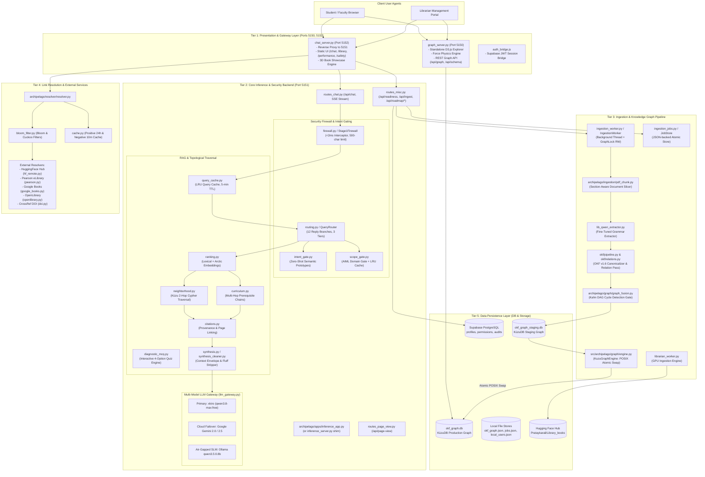
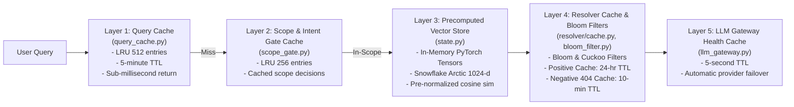
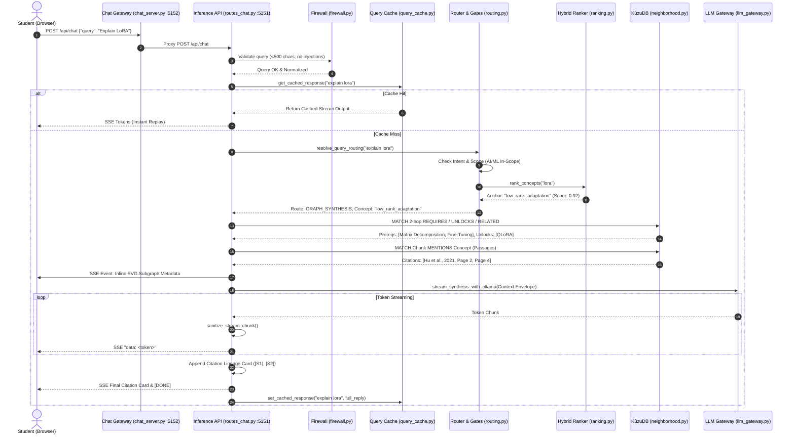
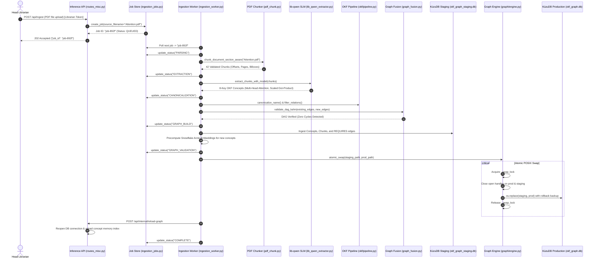

# Archipelago: Comprehensive Codebase Architecture, Function Map & System Blueprint

> **System Blueprint & Architectural Reference Document**  
> *Generated for: Pratay Karali & Archipelago Engineering Team*  
> *Repository Scope: Full Monorepo (`/home/pratay-karali/Desktop/archipelago` and `/Archipelago`)*

---

## Executive Summary & System Overview

**Archipelago** is an open-source, local-first, domain-agnostic Knowledge Graph pipeline and pedagogical AI Librarian platform. It transforms raw, unstructured multi-format documents (PDFs, Markdown, scientific papers, textbooks, and library catalog reports) into a structured **Open Knowledge Format (OKF v1.6)** graph database backed by **KùzuDB** (an embedded graph database) and provides a secure, streaming multi-model inference engine.

Unlike generative "homework solvers" or simple document search wrappers, Archipelago strictly enforces **"The Doorstep Model" (Pedagogical Cartographer)**:
1. **Zero Cognitive Outsourcing**: It refuses direct assignment completion or arbitrary code generation.
2. **First-Principles Guidance**: It maps student queries to foundational prerequisites, theoretical mechanisms, and downstream applications.
3. **Provable Provenance**: Every response badge (`[S1]`, `[S2]`) maps directly to immutable document passage coordinates (`#page=N`), verified chunk hashes, and institutional physical shelf locations.
4. **Resilient Microservices**: Features three decoupled runtime servers (Chat Gateway on `5152`, Inference Backend on `5151`, Graph Explorer on `5150`), a zero-downtime POSIX atomic database swap mechanism, and a multi-tier LLM gateway with automatic cloud-to-local failover.

---

## Master Architecture & Component Topology



---

## 1. Complete File, Function & Relationship Map

Below is the exhaustive inventory of all source files across the codebase, organized by feature layer. Each entry documents its exact path, primary features, all defined functions/classes with signatures, and its incoming/outgoing dependency relationships.

### 1.1 Root Process Entrypoints & Compatibility Shims

| File Path | Feature Module | Exported Symbols & Signatures | Inbound Connections (Called By) | Outbound Connections (Calls / Imports) |
|---|---|---|---|---|
| [`app.py`](file:///home/pratay-karali/Desktop/archipelago/Archipelago/app.py) | Production REST App Entrypoint | - `app`: Flask application instance | Docker container entrypoint, Gunicorn, systemd units | [`src.api.app`](file:///home/pratay-karali/Desktop/archipelago/Archipelago/src/api/app.py) |
| [`chat_server.py`](file:///home/pratay-karali/Desktop/archipelago/Archipelago/chat_server.py) | Chat UI & Gateway Server (Port 5052/5152) | - `serve_index()`<br>- `serve_chat()`<br>- `serve_library()`<br>- `serve_performance()`<br>- `serve_safety()`<br>- `proxy_chat()`<br>- `proxy_readiness()`<br>- `proxy_resolve()` | Browser clients navigating to `/chat`, `/library`, `/performance`, `/safety` | `requests` (proxies to Port 5051/5151 `/api/chat`), static assets under `ui/chat/` |
| [`graph_server.py`](file:///home/pratay-karali/Desktop/archipelago/Archipelago/graph_server.py) | Standalone Graph Explorer (Port 5050/5150) | - `load_graph()`: Reads `okf_graph.json`<br>- `api_graph()`: Returns nodes and links<br>- `api_schema()`: Returns OKF v1.6 specification<br>- `api_node(node_id)`: Fetches 1 node + edges<br>- `api_stats()`: Topology metrics<br>- `check_token()`: RBAC gate for mutations | Browser clients opening `http://localhost:5050` or `5150` | `okf_graph.json`, static files in `ui/graph/`, `buttons/`, `ui/assets/` |
| [`inference_server.py`](file:///home/pratay-karali/Desktop/archipelago/Archipelago/inference_server.py) | Backward Compatibility Shim | Re-exports all symbols from `archipelago.inference.*`:<br>- `app`<br>- `CONCEPTS_DATA`<br>- `db`<br>- `rank_concepts`<br>- `resolve_query_routing`<br>- `api_chat`<br>- `readiness` | Legacy test suites (`tests/integration/test_inference_contract.py`, etc.) | Delegates 100% to [`archipelago.inference.*`](file:///home/pratay-karali/Desktop/archipelago/Archipelago/archipelago/inference) |
| [`ingestion_worker.py`](file:///home/pratay-karali/Desktop/archipelago/Archipelago/ingestion_worker.py) | Live Ingestion Worker Thread & Concurrency Lock | - `class GraphLock`: Reader-writer synchronization lock (`read_lock()`, `write_lock()`)<br>- `class IngestionWorker(threading.Thread)`: Sequential job executor (`enqueue(job_id)`, `run()`, `stop()`) | [`routes_misc.py`](file:///home/pratay-karali/Desktop/archipelago/Archipelago/archipelago/inference/routes_misc.py), system startup | [`ingestion_jobs.JobStore`](file:///home/pratay-karali/Desktop/archipelago/Archipelago/ingestion_jobs.py), [`okf.pipeline.run_pipeline_staged`](file:///home/pratay-karali/Desktop/archipelago/Archipelago/okf/pipeline_staged.py), `kuzu` |
| [`ingestion_jobs.py`](file:///home/pratay-karali/Desktop/archipelago/Archipelago/ingestion_jobs.py) | Thread-Safe JSON Job Store | - `class JobStatus(str, Enum)`<br>- `class JobRecord`: Dataclass for job state<br>- `class JobStore`: Atomic file-backed CRUD (`create_job()`, `get_job()`, `update_job()`, `list_jobs()`) | [`ingestion_worker.py`](file:///home/pratay-karali/Desktop/archipelago/Archipelago/ingestion_worker.py), [`routes_misc.py`](file:///home/pratay-karali/Desktop/archipelago/Archipelago/archipelago/inference/routes_misc.py) | Filesystem (`jobs/jobs.json`, `jobs/<job_id>/`) |
| [`catalog_bridge.py`](file:///home/pratay-karali/Desktop/archipelago/Archipelago/catalog_bridge.py) | KùzuDB Catalog Bridge | - `link_resource_to_document(db_path, resource_title, doc_id, pdf_url)`<br>- `auto_link_resources(db_path)`: Fuzzy title/filename linker | [`scripts/ops/ingest_real_lib.py`](file:///home/pratay-karali/Desktop/archipelago/Archipelago/scripts/ops/ingest_real_lib.py), integration tests | `kuzu`, `thefuzz.fuzz` |
| [`catalog_ingest.py`](file:///home/pratay-karali/Desktop/archipelago/Archipelago/catalog_ingest.py) | Catalog Ingestion Driver | - `ingest_catalog_from_sheets(db_path, sheets)` | Setup scripts, administrative jobs | `kuzu`, [`catalog_schema.py`](file:///home/pratay-karali/Desktop/archipelago/Archipelago/catalog_schema.py) |
| [`catalog_ranking.py`](file:///home/pratay-karali/Desktop/archipelago/Archipelago/catalog_ranking.py) | Physical Catalog Ranking | - `rank_catalog_resources(query, resources, limit)` | [`library_queries.py`](file:///home/pratay-karali/Desktop/archipelago/Archipelago/archipelago/inference/library_queries.py) | `thefuzz.fuzz` |
| [`catalog_schema.py`](file:///home/pratay-karali/Desktop/archipelago/Archipelago/catalog_schema.py) | KùzuDB Catalog DDL | - `create_schema(conn)`: Creates `Subject`, `Resource`, `Document`, `CATEGORIZES`, `PROVIDES_TEXT` tables | [`catalog_ingest.py`](file:///home/pratay-karali/Desktop/archipelago/Archipelago/catalog_ingest.py), [`okf/graph/common.py`](file:///home/pratay-karali/Desktop/archipelago/Archipelago/okf/graph/common.py) | `kuzu` |
| [`evaluate_pdf_catalog.py`](file:///home/pratay-karali/Desktop/archipelago/Archipelago/evaluate_pdf_catalog.py) | PDF Library Audit Tool | - `audit_catalog_coverage(pdf_dir, catalog_file)` | Offline verification scripts | `pathlib`, `json` |
| [`firewall.py`](file:///home/pratay-karali/Desktop/archipelago/Archipelago/firewall.py) | Deterministic Security Interceptor | - `class Stage1Firewall`: Query length validation, prompt injection detection, and cosine kill switch evaluation | [`routes_chat.py`](file:///home/pratay-karali/Desktop/archipelago/Archipelago/archipelago/inference/routes_chat.py), [`src/api/app.py`](file:///home/pratay-karali/Desktop/archipelago/Archipelago/src/api/app.py) | [`src.core.router.QueryRouter`](file:///home/pratay-karali/Desktop/archipelago/Archipelago/src/core/router.py), `numpy` |
| [`mock_data.py`](file:///home/pratay-karali/Desktop/archipelago/Archipelago/mock_data.py) | Mock Graph Fixtures | - `MOCK_CONCEPTS`: Dictionary of test nodes<br>- `MOCK_EDGES`: List of test edges | Unit tests (`tests/unit/test_fixtures.py`) | None |
| [`okf_extraction.py`](file:///home/pratay-karali/Desktop/archipelago/Archipelago/okf_extraction.py) | Extraction Compatibility Shim | Re-exports `okf.extraction.*` | Tests, legacy scripts | [`okf.extraction`](file:///home/pratay-karali/Desktop/archipelago/Archipelago/okf/extraction.py) |
| [`okf_pipeline.py`](file:///home/pratay-karali/Desktop/archipelago/Archipelago/okf_pipeline.py) | Pipeline CLI Shim | Re-exports `okf.pipeline.run_pipeline` | Command-line executions (`python okf_pipeline.py`) | [`okf.pipeline`](file:///home/pratay-karali/Desktop/archipelago/Archipelago/okf/pipeline.py) |
| [`pdf_ingestion.py`](file:///home/pratay-karali/Desktop/archipelago/Archipelago/pdf_ingestion.py) | Document Chunker Compatibility Shim | Re-exports `archipelago.ingestion.pdf_chunk.*` | Ingestion scripts | [`archipelago.ingestion.pdf_chunk`](file:///home/pratay-karali/Desktop/archipelago/Archipelago/archipelago/ingestion/pdf_chunk.py) |
| [`prompt_assembly.py`](file:///home/pratay-karali/Desktop/archipelago/Archipelago/prompt_assembly.py) | Context Isolation Shim | Re-exports `PromptPayloadAssembler`, `MAX_CHUNKS`, `MAX_GRAPH_NODES` | Legacy imports | [`src.core.prompt_assembly`](file:///home/pratay-karali/Desktop/archipelago/Archipelago/src/core/prompt_assembly.py) |
| [`retrieval.py`](file:///home/pratay-karali/Desktop/archipelago/Archipelago/retrieval.py) | Hybrid Retrieval Shim | Re-exports `TwoPassHybridRetriever` | Legacy imports | [`src.core.retrieval`](file:///home/pratay-karali/Desktop/archipelago/Archipelago/src/core/retrieval.py) |
| [`router.py`](file:///home/pratay-karali/Desktop/archipelago/Archipelago/router.py) | Intent Router Shim | Re-exports `QueryRouter`, `QueryIntent`, `RoutingTier` | Legacy imports | [`src.core.router`](file:///home/pratay-karali/Desktop/archipelago/Archipelago/src/core/router.py) |
| [`synthesis_service.py`](file:///home/pratay-karali/Desktop/archipelago/Archipelago/synthesis_service.py) | Synthesis Orchestrator Shim | Re-exports `SynthesisService` | Legacy imports | [`src.core.synthesis_service`](file:///home/pratay-karali/Desktop/archipelago/Archipelago/src/core/synthesis_service.py) |
| [`test_inference.py`](file:///home/pratay-karali/Desktop/archipelago/Archipelago/test_inference.py) | CLI Test Harness | - `test_inference(query, verbose)` | Manual testing | `requests`, `json` |
| [`books_showcase_src.tsx`](file:///home/pratay-karali/Desktop/archipelago/Archipelago/books_showcase_src.tsx) | 3D Three.js Book Showcase Source | - `interface BookCfg`<br>- `export function BooksShowcase(props: BooksShowcaseProps)` | React frontend build pipeline (compiled into `ui/chat/library_showcase_3d.js`) | `three`, `@/lib/utils` |

---

### 1.2 Core Application Package (`archipelago/`)

#### A. Applications & Security (`archipelago/apps/`, `archipelago/auth.py`)

*   [`archipelago/apps/inference_app.py`](file:///home/pratay-karali/Desktop/archipelago/Archipelago/archipelago/apps/inference_app.py):
    *   **Functions**: `main()` (Initializes concept dictionaries, starts background embedding precomputation threads for Snowflake Arctic and optional Aura SLM, binds Flask application to host/port with multi-threading enabled).
    *   **Connections**: Called via `python -m archipelago.apps.inference_app` or systemd service; imports `archipelago.inference.bootstrap` and `archipelago.inference.embeddings`.
*   [`archipelago/auth.py`](file:///home/pratay-karali/Desktop/archipelago/Archipelago/archipelago/auth.py):
    *   **Functions**: `_extract_token() -> str | None`, `librarian_token_expected() -> str`, `is_librarian_request() -> bool`, `require_librarian(fn)` (protects mutating endpoints: uploads, deletions, manual edge insertion), `require_student_or_open(fn)` (marks public student-facing read/chat endpoints).
    *   **Connections**: Wraps handlers in `routes_chat.py` and `routes_misc.py`.

#### B. Core Graph Engine (`archipelago/graph/`)

*   [`archipelago/graph/engine.py`](file:///home/pratay-karali/Desktop/archipelago/Archipelago/archipelago/graph/engine.py):
    *   **Functions**: Re-exports `KuzuGraphEngine`, `_swap_lock`, `_active_instances` dynamically from `src/archipelago/graph/engine.py`.
*   [`src/archipelago/graph/engine.py`](file:///home/pratay-karali/Desktop/archipelago/Archipelago/src/archipelago/graph/engine.py):
    *   **Classes & Methods**:
        *   `class KuzuGraphEngine`: Embedded KùzuDB manager.
            *   `__init__(db_path, read_only=False, buffer_pool_size=0)`
            *   `execute(query, parameters=None) -> list[dict]`
            *   `close()`: Releases lock handles.
            *   `close_all_for_path(db_path) -> list[KuzuGraphEngine]`: Closes tracked instances before file swaps.
            *   `atomic_swap(staging_db_path, production_db_path)`: Thread-safe connection switch: acquires `_swap_lock`, closes active handles on staging and production to prevent `EBUSY`, invokes POSIX `os.replace` with `.old` backup and automatic rollback on error.
    *   **Connections**: Used by `librarian_worker.py`, `ingestion_worker.py`, and `state.py`.
*   [`archipelago/graph/graph_fusion.py`](file:///home/pratay-karali/Desktop/archipelago/Archipelago/archipelago/graph/graph_fusion.py):
    *   **Classes & Methods**:
        *   `class GraphFusionEngine`:
            *   `validate_dag_kahn(existing_nodes, existing_edges, new_nodes, new_edges) -> tuple[bool, list[tuple[str, str]]]`: Evaluates prospective `REQUIRES` edges using Kahn's topological sort algorithm, rejecting any edges that would introduce cycles.
            *   `fuse_batch(new_nodes, new_edges) -> dict`: Ingests nodes and edges into KùzuDB within transactional boundaries under `MAX_BATCH_NODES = 150` thresholding.
    *   **Connections**: Used by `librarian_worker.py` and `okf/cleanup_parts/cycles.py`.
*   [`archipelago/graph/integrity.py`](file:///home/pratay-karali/Desktop/archipelago/Archipelago/archipelago/graph/integrity.py):
    *   **Functions**: Validates schema consistency and dangling reference detection.

---

### 1.3 Inference, RAG & Reasoning (`archipelago/inference/`)

This package contains the core intelligence of Archipelago, implementing query routing, vector search, graph traversal, and response synthesis.

| File Name | Functions / Classes | Responsibilities & Architectural Flow |
|---|---|---|
| [`state.py`](file:///home/pratay-karali/Desktop/archipelago/Archipelago/archipelago/inference/state.py) | - `class _LazyDB`<br>- `get_db(read_only=None)`<br>- `reload_db()`<br>- Globals: `app`, `CONCEPTS_DATA`, `CONCEPT_IDS`, `CONCEPT_EMBEDDINGS`, `SEMANTIC_ANCHOR_THRESHOLD` (0.52), `KILL_SWITCH_THRESHOLD` (0.75) | Holds process-wide shared state. Implements lazy database connection initialization to prevent exclusive lock contention during module import. |
| [`routing.py`](file:///home/pratay-karali/Desktop/archipelago/Archipelago/archipelago/inference/routing.py) | - `resolve_query_routing(query, history=None) -> dict`<br>- `_strip_small_talk(query)`<br>- `_strip_persona_style(query)`<br>- `_run_dual_pass_guard(query)`<br>- `_graph_block_override(query, ranked)`<br>- `_detect_library_intent(query)`<br>- `parse_multi_topic_query(query)` | Full query routing engine. Evaluates queries against 12 pedagogical reply mechanisms (Taxonomy, Curriculum Scaffolding, Prerequisite Audit, Unlock Forecast, Comparative Analysis, Lineage Tracing, Composition Deconstruction, Thematic Clustering, Socratic MCQs, Multi-Hop Roadmaps, Out-of-Corpus Fallback, Librarian Staging). |
| [`ranking.py`](file:///home/pratay-karali/Desktop/archipelago/Archipelago/archipelago/inference/ranking.py) | - `rank_concepts(query, top_k=None) -> list`<br>- `find_anchor_concept(query) -> tuple`<br>- `normalize_user_query(query) -> str`<br>- `_score_lexical_fit(query, label, summary) -> float`<br>- `_has_surface_concept_hit(ranked, query) -> bool`<br>- `_has_strong_graph_evidence(ranked) -> bool` | Hybrid retrieval ranking engine. Combines Snowflake Arctic cosine similarity vectors with lexical token scoring, acronym bonuses, and domain term heuristics. |
| [`neighborhood.py`](file:///home/pratay-karali/Desktop/archipelago/Archipelago/archipelago/inference/neighborhood.py) | - `get_graph_neighborhood(concept_id, k=2) -> tuple`<br>- `get_concept_citations(concept_id, limit=2) -> list`<br>- `get_related_edges(concept_id, limit=8) -> list`<br>- `filter_prereqs(target_id, prereqs) -> list`<br>- `is_plausible_prereq(target_id, prereq_id) -> bool`<br>- `get_bounded_subgraph(concept_id, ...)` | Executes Cypher queries over KùzuDB to retrieve 2-hop prerequisite (`REQUIRES`) and downstream application (`UNLOCKS`) subgraphs. Enforces sanity filters against inverted prerequisites. |
| [`curriculum.py`](file:///home/pratay-karali/Desktop/archipelago/Archipelago/archipelago/inference/curriculum.py) | - `find_curriculum_chains(concept_id, max_hops=3) -> list`<br>- `find_roadmap_between(concept_a, concept_b) -> dict`<br>- `generate_diagnostic_quiz(concept_id) -> list`<br>- `evaluate_quiz_and_route_roadmap(quiz_answers) -> dict` | Computes directed acyclic curriculum paths from foundational concepts to advanced topics. Generates diagnostic checkpoints between topics. |
| [`citations.py`](file:///home/pratay-karali/Desktop/archipelago/Archipelago/archipelago/inference/citations.py) | - `build_concept_citation_map(target, prereqs, unlocks)`<br>- `build_citation_payloads(...)`<br>- `validate_citations(model_output, evidence_ids)`<br>- `cleanse_model_citations(text, payloads)`<br>- `_resolve_printed_page(evidence)` | Resolves PDF page coordinates (`#page=N`) and verbatim passages for citations. Prevents citation hallucination by validating that emitted badges exist in retrieved evidence. |
| [`synthesis.py`](file:///home/pratay-karali/Desktop/archipelago/Archipelago/archipelago/inference/synthesis.py) | - `stream_synthesis_with_ollama(...)`<br>- `synthesize_with_ollama_streaming(...)`<br>- `build_graph_notes(...)`<br>- `format_natural_fallback(...)`<br>- `render_library_books(topic, books)`<br>- `render_library_chapters(title, chapters)`<br>- `identity_reply(...)`<br>- `onboarding_reply(...)`<br>- `enforce_sterile_prose(text)` | Assembles context envelopes for language models. Contains natural fallback template generators for offline mode and sterile prose enforcement. |
| [`llm_gateway.py`](file:///home/pratay-karali/Desktop/archipelago/Archipelago/archipelago/inference/llm_gateway.py) | - `configure_gateway()`<br>- `is_llm_available() -> bool`<br>- `gateway_chat(messages, purpose=...)`<br>- `gateway_chat_stream(messages, purpose=...)` | Multi-model routing gateway with automatic failover. Primary: xkiro (`qwen3.8-max:free`). Fallback: Google Gemini (Flash, Flash-Lite, 2.5 Flash, Pro). Offline: Local Ollama SLM. |
| [`diagnostic_mcq.py`](file:///home/pratay-karali/Desktop/archipelago/Archipelago/archipelago/inference/diagnostic_mcq.py) | - `class DiagnosticMCQ`<br>- `generate_diagnostic_mcqs(concept_id)`<br>- `validate_mcq_submission(submission)`<br>- `execute_adaptive_step(student_id, answer)`<br>- `build_personalized_graph_dag(...)` | Generates 4-option multiple choice questions with pedagogical distractors to verify concept mastery before allowing curriculum advancement. |
| [`query_cache.py`](file:///home/pratay-karali/Desktop/archipelago/Archipelago/archipelago/inference/query_cache.py) | - `normalize_query(query) -> str`<br>- `get_cached_response(query) -> Any | None`<br>- `set_cached_response(query, response, ttl=300.0)`<br>- `clear_cache()` | In-memory thread-safe LRU query cache (max 512 entries, default TTL 300s). Short-circuits duplicate queries at zero token cost. |
| [`intent_gate.py`](file:///home/pratay-karali/Desktop/archipelago/Archipelago/archipelago/inference/intent_gate.py) | - `classify_intent(query) -> tuple[str, float]`<br>- `intent_to_block_reason(intent) -> str` | Zero-shot intent classification using semantic prototypes (Theory, Implementation, Out-of-Domain, Entity Trivia, Meta, Social). Replaces fragile regex/keyword banlists. |
| [`scope_gate.py`](file:///home/pratay-karali/Desktop/archipelago/Archipelago/archipelago/inference/scope_gate.py) | - `is_aiml_in_scope(query) -> bool`<br>- `parse_scope_answer(text) -> bool | None` | Quick binary classifier for AI/ML and CS relevance, backed by a 256-entry in-memory LRU cache. |
| [`routes_chat.py`](file:///home/pratay-karali/Desktop/archipelago/Archipelago/archipelago/inference/routes_chat.py) | - `api_chat()`: POST `/api/chat`<br>- `api_diagnostic_mcqs()`: `/api/chat/diagnostic-mcqs`<br>- `api_verify_mcq()`: `/api/chat/verify-mcq`<br>- `api_adaptive_step()`: `/api/chat/adaptive-step`<br>- `api_telemetry()`: `/api/chat/telemetry` | Core streaming chat endpoint emitting SSE events (`[STREAM_START]`, token deltas, inline graph metadata, and verified citation cards). |
| [`routes_misc.py`](file:///home/pratay-karali/Desktop/archipelago/Archipelago/archipelago/inference/routes_misc.py) | - `readiness()`: `/api/readiness`<br>- `ingest_upload()`: `/api/ingest`<br>- `ingest_status()`: `/api/ingest/<job_id>`<br>- `ingest_cancel()`: `/api/ingest/<job_id>/cancel`<br>- `documents()`: `/api/documents`<br>- `document_delete()`: `/api/documents/<doc_id>`<br>- `manual_concept()`: `/api/manual/concept`<br>- `manual_edge()`: `/api/manual/edge`<br>- `reload_graph()`: `/api/internal/reload-graph`<br>- `roadmap_plan()`: `/api/roadmap/plan`<br>- `roadmap_between()`: `/api/roadmap/between` | Administrative, ingestion, roadmap, and operational REST endpoints. |
| [`routes_page_view.py`](file:///home/pratay-karali/Desktop/archipelago/Archipelago/archipelago/inference/routes_page_view.py) | - `page_view()`: GET `/api/page-view` | Resolves document IDs and page numbers to precise passage snippets and direct PDF viewer URLs for deep-linking. |
| [`routes_context.py`](file:///home/pratay-karali/Desktop/archipelago/Archipelago/archipelago/inference/routes_context.py) | - `context_status()`: GET/POST `/api/context-status` | Session context interrogation and reset endpoint. |
| [`catalog_ops.py`](file:///home/pratay-karali/Desktop/archipelago/Archipelago/archipelago/inference/catalog_ops.py) | - `subject_title_counts()`<br>- `highest_title_count_subject()`<br>- `journal_title_and_issue_totals()`<br>- `resource_kind_counts()`<br>- `zero_available_copies()`<br>- `copies_for_title(query)` | Analytics and query operations over physical library catalogs and ODS reports. |
| [`library_queries.py`](file:///home/pratay-karali/Desktop/archipelago/Archipelago/archipelago/inference/library_queries.py) | - `get_book_metadata_details(query)`<br>- `get_books_for_topic(query)`<br>- `get_chapters_of_book(query)`<br>- `get_library_hours_response()`<br>- `get_library_holdings_response(query)` | High-level library inquiry dispatcher handling book metadata, chapter lookups, and inventory availability. |
| [`library_schedules.py`](file:///home/pratay-karali/Desktop/archipelago/Archipelago/archipelago/inference/library_schedules.py) | - `LIBRARY_SCHEDULES`<br>- `get_schedule(day)` | Fixed 24x7x365 institutional operating schedule lookup (zero LLM token burn). |
| [`library_credentials.py`](file:///home/pratay-karali/Desktop/archipelago/Archipelago/archipelago/inference/library_credentials.py) | - `E_RESOURCE_CREDENTIALS`<br>- `format_credential_for_response(res)` | Institutional e-resource directory with automated password and credential masking. |
| [`rate_limit.py`](file:///home/pratay-karali/Desktop/archipelago/Archipelago/archipelago/inference/rate_limit.py) | - `class SlidingWindowLimiter`: Sliding-window rate limiter | Prevents API flooding with per-minute (20), burst (50), and global (500) caps. |
| [`context_tracker.py`](file:///home/pratay-karali/Desktop/archipelago/Archipelago/archipelago/inference/context_tracker.py) | - `class SessionContext`<br>- `get_or_create_context(session_id)` | Tracks active conversation concepts and multi-turn user intent. |
| [`synthesis_cleaner.py`](file:///home/pratay-karali/Desktop/archipelago/Archipelago/archipelago/inference/synthesis_cleaner.py) | - `cleanse_synthesis_stream(text)`<br>- `is_glued(text)` | 4-tier output cleaner stripping hallucinations, glued words, prompt leaks, and non-sterile conversational filler. |
| [`subgraph.py`](file:///home/pratay-karali/Desktop/archipelago/Archipelago/archipelago/inference/subgraph.py) | - `generate_bounded_subgraph(...)` | Extracts small, clean subgraphs for in-chat SVG rendering. |
| [`okf_watcher.py`](file:///home/pratay-karali/Desktop/archipelago/Archipelago/archipelago/inference/okf_watcher.py) | - `class OKFWatcherDaemon(threading.Thread)` | Background daemon monitoring `/data/catalogs` and `/data/koha` to auto-trigger graph synchronization. |

---

### 1.4 Document Ingestion & Extraction (`archipelago/ingestion/`)

*   [`archipelago/ingestion/pdf_chunk.py`](file:///home/pratay-karali/Desktop/archipelago/Archipelago/archipelago/ingestion/pdf_chunk.py):
    *   **Functions**: `chunk_document_section_aware(pdf_path, chunk_size=1000, overlap=150) -> list[dict]`, `extract_pdf_pages_with_metadata(pdf_path)`.
    *   **Responsibilities**: Uses PyMuPDF (`fitz`) to slice documents along section headers (`#`, `##`, `Abstract`, `Introduction`, `References`), preserving mathematical notation, bounding box coordinates (`block_x`, `block_y`), and page labels while skipping bibliographies.
*   [`archipelago/ingestion/lib_qwen_extractor.py`](file:///home/pratay-karali/Desktop/archipelago/Archipelago/archipelago/ingestion/lib_qwen_extractor.py):
    *   **Classes & Functions**:
        *   `class LibQwenConceptExtractor`: Grammar-constrained local extractor leveraging quantized `lib-qwen-v44-q8_0.gguf` or Hugging Face LoRA weights on GPU.
        *   `canonical_concept_id(name) -> str`: Produces deterministic slugified IDs.
        *   `canonicalize_concept_name(name) -> str`: Normalizes title casing and expands standard acronyms.
        *   `is_negative_sample(passage) -> bool`: Filters boilerplate and legal disclaimers.
*   [`archipelago/ingestion/librarian_worker.py`](file:///home/pratay-karali/Desktop/archipelago/Archipelago/archipelago/ingestion/librarian_worker.py):
    *   **Classes & Functions**:
        *   `class LibrarianIngestionWorker`: Background ingestion queue processor. Handles document staging, high-yield filtering, GPU extraction, cycle verification via Kahn's algorithm, staging DB population, and initiates atomic database swaps.
*   [`archipelago/ingestion/pearson_connector.py`](file:///home/pratay-karali/Desktop/archipelago/Archipelago/archipelago/ingestion/pearson_connector.py):
    *   **Classes & Functions**:
        *   `class PearsonBook`: Models Pearson textbooks, ISBNs, chapter hierarchies, and reader URLs.
        *   `class PearsonCatalog`: Parses bookshelf manifests (`data/catalogs/pearson_bookshelf.json`).

---

### 1.5 The OKF v1.6 Extraction & Graph Engine (`okf/`)

The `okf/` package forms the core pipeline that extracts concepts conforming to the **Open Knowledge Format (OKF v1.6)** schema and compiles them into KùzuDB.

```
okf/
├── config.py              # Central OKF configuration, schema constants, prompts
├── extraction.py          # LLM extraction prompts, JSON fence parsers, normalization
├── relations.py           # Relation extraction, candidate pairs, co-occurrence filtering
├── canonicalize.py        # Entity canonicalization & alias clustering
├── alias_index.py         # Inverted alias index (synonym -> canonical concept)
├── co_mention.py          # Extracts co-mention edges from shared chunks
├── unlocks_heuristics.py  # Computes downstream UNLOCKS edges
├── exports.py             # Dumps KùzuDB to okf_graph.json and GraphRAG indices
├── pipeline.py            # Master pipeline runner (extract -> clean -> merge -> export)
├── pipeline_staged.py     # Staged execution runner with progress hooks
├── cleanup_parts/         # Post-extraction normalization transformers
│   ├── cycles.py          # Eliminates circular prerequisites (DAG enforcement)
│   ├── dedupe.py          # Merges duplicate concepts and collapses edges
│   ├── directionality.py  # Difficulty-aware edge orientation
│   ├── domain_scope.py    # Prunes non-technical hallucinations
│   └── grounding.py       # Validates that concepts appear verbatim in source chunks
├── eval/                  # Quality evaluation suite
│   ├── gold.py            # Benchmark against gold-standard papers (Attention, LoRA)
│   ├── metrics.py         # Computes precision, recall, F1, grounding rate
│   └── structural.py      # Audits graph connectivity and topology health
└── graph/                 # KùzuDB graph storage layer
    ├── common.py          # DDL schemas, migrations, Cypher escaping
    ├── ingest.py          # MERGE ingestion for nodes and relationships
    ├── delete_document.py # Cascading document deletion engine
    ├── merge_document.py  # Merges documents into existing graphs
    └── evidence.py        # Passage-to-concept provenance queries
```

---

### 1.6 External Link Resolution & Caching (`archipelago/resolver/`)

This package ensures students can navigate directly from chat citations to verified open-access PDFs, Pearson eLibrary textbooks, or library catalogs without dead links.

*   [`archipelago/resolver/resolver.py`](file:///home/pratay-karali/Desktop/archipelago/Archipelago/archipelago/resolver/resolver.py):
    *   `class LinkResolver`: Master resolution orchestrator. Checks rate limits -> checks positive/negative LRU cache -> checks Bloom & Cuckoo filters -> consults central `ResourceRegistry` -> delegates to external resolvers (Pearson, HuggingFace, Google Books, OpenLibrary, DOI) -> caches result.
*   [`archipelago/resolver/bloom_filter.py`](file:///home/pratay-karali/Desktop/archipelago/Archipelago/archipelago/resolver/bloom_filter.py):
    *   `class BloomFilter`: Optimal bit-array filter (`m` bits, `k` hash functions via SHA-256 and MD5) for instantaneous negative membership testing.
    *   `class CuckooFilter`: High-performance dynamic membership filter supporting displacements and fingerprinted buckets.
*   [`archipelago/resolver/cache.py`](file:///home/pratay-karali/Desktop/archipelago/Archipelago/archipelago/resolver/cache.py):
    *   `class ResolverCache`: Positive cache (TTL: 86,400s / 24h) and negative cache (TTL: 600s / 10m for 404s to avoid hammering external APIs).
    *   `class RateLimiter`: Sliding-window client rate limiter (60 req/min).
*   [`archipelago/resolver/resource_registry.py`](file:///home/pratay-karali/Desktop/archipelago/Archipelago/archipelago/resolver/resource_registry.py):
    *   `class ResourceRegistry`: In-memory registry containing metadata and verified reader URLs for seed textbooks (*Artificial Intelligence: A New Synthesis*, *Mathematics for Machine Learning*, *Deep Learning*, *OSTEP*, etc.).

---

### 1.7 Authentication & User Management (`supabase/`, `src/archipelago/supabase_auth.py`)

Archipelago implements role-based access control (RBAC) with three tiers: **Student**, **Librarian**, and **Administrator**.

*   [`src/archipelago/supabase_auth.py`](file:///home/pratay-karali/Desktop/archipelago/Archipelago/src/archipelago/supabase_auth.py):
    *   `class AuthPrincipal`: Authenticated principal representation (`user_id`, `username`, `role`, `access_token`).
    *   `authenticate_request(request) -> tuple[AuthPrincipal | None, str | None]`: Validates Supabase JWT Bearer token against `SUPABASE_URL/auth/v1/user` and queries `public.profiles`. Falls back to local dev user file (`data/local_users.json`) if Supabase is offline or auth is not required.
    *   `list_managed_users(principal)` / `create_managed_user(...)` / `update_managed_user(...)` / `delete_managed_user(...)`: Full user management CRUD enforcing hierarchical RBAC (Librarians cannot create Administrators; Students cannot manage users).
*   [`supabase/migrations/20260916_000001_auth_roles.sql`](file:///home/pratay-karali/Desktop/archipelago/Archipelago/supabase/migrations/20260916_000001_auth_roles.sql):
    *   PostgreSQL schema: defines `archipelago_role` enum (`student`, `librarian`, `administrator`), `public.profiles` table with cascade delete to `auth.users`, `public.credential_import_permissions`, and `public.credential_import_audits`. Implements row-level security (RLS) policies and security-definer triggers (`on_auth_user_created`).
*   [`supabase/migrations/20260916_000002_auth_performance.sql`](file:///home/pratay-karali/Desktop/archipelago/Archipelago/supabase/migrations/20260916_000002_auth_performance.sql):
    *   Idempotent index optimization on foreign keys and audit query policy unification.

---

### 1.8 Frontends & Visualization UI (`ui/`, `frontend/`)

*   [`ui/chat/index.html`](file:///home/pratay-karali/Desktop/archipelago/Archipelago/ui/chat/index.html): Primary student workspace. Renders streaming markdown text, interactive in-chat SVG subgraphs with pulsing anchor rings, Socratic diagnostic MCQ cards with real-time feedback, and a sliding drawer for academic literature reading lists.
*   [`ui/chat/library.html`](file:///home/pratay-karali/Desktop/archipelago/Archipelago/ui/chat/library.html): Visual catalog browser displaying all indexed concepts, difficulty filter chips, search input, and document upload quarantine dropzones.
*   [`ui/chat/performance.html`](file:///home/pratay-karali/Desktop/archipelago/Archipelago/ui/chat/performance.html): Real-time engineering dashboard graphing P50, P90, P99 latencies, Time-To-First-Token (TTFT), token throughput, and query cache hit rates.
*   [`ui/chat/safety.html`](file:///home/pratay-karali/Desktop/archipelago/Archipelago/ui/chat/safety.html): Compliance monitor showcasing firewall activity logs, detected prompt injections, and token spend.
*   [`ui/chat/login.html`](file:///home/pratay-karali/Desktop/archipelago/Archipelago/ui/chat/login.html): Supabase authentication portal supporting role switching.
*   [`ui/graph/index.html`](file:///home/pratay-karali/Desktop/archipelago/Archipelago/ui/graph/index.html): Standalone hardware-accelerated 60 FPS D3.js force-directed knowledge graph explorer on Port 5050/5150. Allows searching, clustering, and zooming into the entire knowledge topology.

---

## 2. Exhaustive API Reference

Archipelago exposes REST and SSE Streaming APIs across its services. Below is the complete endpoint reference:

### 2.1 Inference Backend & Chat APIs (Port 5051 / 5151)

| Endpoint Path | Method | Handler / Source File | Auth Role | Request Payload / Params | Response Format | Purpose & Description |
|---|---|---|---|---|---|---|
| `/api/chat` | `POST` | `api_chat` in [`routes_chat.py`](file:///home/pratay-karali/Desktop/archipelago/Archipelago/archipelago/inference/routes_chat.py) | Student (Public) | `{"query": str, "history": list, "mode": str}` | `text/event-stream` (SSE) | Main streaming chat endpoint. Returns `[STREAM_START]` followed by token deltas, inline SVG graph data, and `[S1]` verified citations. |
| `/api/chat/diagnostic-mcqs` | `GET`, `POST` | `api_diagnostic_mcqs` in [`routes_chat.py`](file:///home/pratay-karali/Desktop/archipelago/Archipelago/archipelago/inference/routes_chat.py) | Student (Public) | `{"concept_id": str}` or `?concept_id=...` | `application/json` | Generates 3 targeted diagnostic multiple-choice questions for upstream prerequisites. |
| `/api/chat/verify-mcq` | `POST` | `api_verify_mcq` in [`routes_chat.py`](file:///home/pratay-karali/Desktop/archipelago/Archipelago/archipelago/inference/routes_chat.py) | Student (Public) | `{"concept_id": str, "question_index": int, "selected_option": str}` | `application/json` | Validates student answers and returns explanations grounded in citations. |
| `/api/chat/adaptive-step` | `POST` | `api_adaptive_step` in [`routes_chat.py`](file:///home/pratay-karali/Desktop/archipelago/Archipelago/archipelago/inference/routes_chat.py) | Student (Public) | `{"student_id": str, "concept_id": str, "answer": str}` | `application/json` | Adjusts curriculum difficulty based on continuous quiz performance. |
| `/api/chat/telemetry` | `POST` | `api_telemetry` in [`routes_chat.py`](file:///home/pratay-karali/Desktop/archipelago/Archipelago/archipelago/inference/routes_chat.py) | Public | `{"event": str, "latency_ms": float, "tokens": int}` | `application/json` | Records client-side latency, TTFT, and rendering metrics. |
| `/api/readiness` | `GET` | `readiness` in [`routes_misc.py`](file:///home/pratay-karali/Desktop/archipelago/Archipelago/archipelago/inference/routes_misc.py) | Public | None | `application/json` | System health check reporting KùzuDB status, loaded concept counts, and LLM reachability. |
| `/api/page-view` | `GET` | `page_view` in [`routes_page_view.py`](file:///home/pratay-karali/Desktop/archipelago/Archipelago/archipelago/inference/routes_page_view.py) | Public | `?doc_id=...&page=...&highlight=...` | `application/json` | Resolves document citations to verbatim passages and deep PDF reader links. |
| `/api/context-status` | `GET`, `POST` | `context_status` in [`routes_context.py`](file:///home/pratay-karali/Desktop/archipelago/Archipelago/archipelago/inference/routes_context.py) | Public | `{"session_id": str, "action": "reset"}` | `application/json` | Inspects or resets active session conversation memory and topic state. |
| `/api/roadmap/plan` | `POST` | `roadmap_plan` in [`routes_misc.py`](file:///home/pratay-karali/Desktop/archipelago/Archipelago/archipelago/inference/routes_misc.py) | Student (Public) | `{"target_concept": str, "depth": int}` | `application/json` | Computes full multi-hop prerequisite learning roadmap to master a target concept. |
| `/api/roadmap/between` | `GET`, `POST` | `roadmap_between` in [`routes_misc.py`](file:///home/pratay-karali/Desktop/archipelago/Archipelago/archipelago/inference/routes_misc.py) | Student (Public) | `{"concept_a": str, "concept_b": str}` | `application/json` | Computes shortest and most pedagogically sound graph path between two concepts. |
| `/api/roadmap/quiz` | `GET`, `POST` | `roadmap_quiz` in [`routes_misc.py`](file:///home/pratay-karali/Desktop/archipelago/Archipelago/archipelago/inference/routes_misc.py) | Student (Public) | `{"roadmap_nodes": list}` | `application/json` | Generates a diagnostic quiz along an entire roadmap progression. |
| `/api/ingest` | `POST` | `ingest_upload` in [`routes_misc.py`](file:///home/pratay-karali/Desktop/archipelago/Archipelago/archipelago/inference/routes_misc.py) | Librarian Token | Multipart form data with `file` (PDF/MD/TXT) | `application/json` | Quarantines document in `jobs/<job_id>`, enqueues background ingestion. |
| `/api/ingest/<job_id>` | `GET` | `ingest_status` in [`routes_misc.py`](file:///home/pratay-karali/Desktop/archipelago/Archipelago/archipelago/inference/routes_misc.py) | Public | Path variable `job_id` | `application/json` | Polling endpoint returning active stage and progress metrics. |
| `/api/ingest/<job_id>/cancel` | `POST` | `ingest_cancel` in [`routes_misc.py`](file:///home/pratay-karali/Desktop/archipelago/Archipelago/archipelago/inference/routes_misc.py) | Librarian Token | Path variable `job_id` | `application/json` | Requests soft-cancellation of an in-flight ingestion pipeline job. |
| `/api/documents` | `GET` | `documents` in [`routes_misc.py`](file:///home/pratay-karali/Desktop/archipelago/Archipelago/archipelago/inference/routes_misc.py) | Public | None | `application/json` | Returns list of all indexed source documents, page counts, and node counts. |
| `/api/documents/<doc_id>` | `DELETE` | `document_delete` in [`routes_misc.py`](file:///home/pratay-karali/Desktop/archipelago/Archipelago/archipelago/inference/routes_misc.py) | Librarian Token | Path variable `doc_id` | `application/json` | Cascading deletion of document, chunks, and orphan concepts from KùzuDB. |
| `/api/manual/concept` | `POST` | `manual_concept` in [`routes_misc.py`](file:///home/pratay-karali/Desktop/archipelago/Archipelago/archipelago/inference/routes_misc.py) | Librarian Token | `{"name": str, "type": str, "difficulty": str, "summary": str}` | `application/json` | Manually inserts or updates a concept node in the live KùzuDB graph. |
| `/api/manual/edge` | `POST` | `manual_edge` in [`routes_misc.py`](file:///home/pratay-karali/Desktop/archipelago/Archipelago/archipelago/inference/routes_misc.py) | Librarian Token | `{"source_id": str, "target_id": str, "edge_type": str}` | `application/json` | Inserts a directional relationship edge into KùzuDB after Kahn cycle check. |
| `/api/internal/reload-graph` | `POST` | `reload_graph` in [`routes_misc.py`](file:///home/pratay-karali/Desktop/archipelago/Archipelago/archipelago/inference/routes_misc.py) | Internal Secret | None | `application/json` | Hot-reloads in-memory concept caches and reconnects KùzuDB after atomic swaps. |
| `/api/auth/config` | `GET` | `auth_config` in [`routes_misc.py`](file:///home/pratay-karali/Desktop/archipelago/Archipelago/archipelago/inference/routes_misc.py) | Public | None | `application/json` | Returns browser-safe Supabase configuration (URL, publishable key; never secret key). |
| `/api/auth/me` | `GET` | `auth_me` in [`routes_misc.py`](file:///home/pratay-karali/Desktop/archipelago/Archipelago/archipelago/inference/routes_misc.py) | Authenticated | Bearer JWT Header | `application/json` | Returns profile, username, and role of the currently authenticated principal. |
| `/api/users` | `GET`, `POST` | `manage_users` in [`routes_misc.py`](file:///home/pratay-karali/Desktop/archipelago/Archipelago/archipelago/inference/routes_misc.py) | Librarian / Admin | `{"username": str, "role": str, "password": str}` | `application/json` | User administration endpoint (lists or provisions new users). |
| `/pdfs/<path:filename>` | `GET` | `serve_pdf` in [`routes_misc.py`](file:///home/pratay-karali/Desktop/archipelago/Archipelago/archipelago/inference/routes_misc.py) | Public | Path variable `filename` | `application/pdf` | Serves academic research papers and book PDFs with byte-range support. |

---

### 2.2 Standalone Graph Server APIs (Port 5050 / 5150)

| Endpoint Path | Method | Handler / Source File | Request / Params | Response Format | Purpose & Description |
|---|---|---|---|---|---|
| `/api/graph` | `GET` | `api_graph` in [`graph_server.py`](file:///home/pratay-karali/Desktop/archipelago/Archipelago/graph_server.py) | None | `application/json` | Returns full graph payload (`nodes`, `edges`, `clusters`, `stats`) for D3 explorer. |
| `/api/schema` | `GET` | `api_schema` in [`graph_server.py`](file:///home/pratay-karali/Desktop/archipelago/Archipelago/graph_server.py) | None | `application/json` | Returns OKF v1.6 schema definition for the explorer side-drawer. |
| `/api/node/<node_id>` | `GET` | `api_node` in [`graph_server.py`](file:///home/pratay-karali/Desktop/archipelago/Archipelago/graph_server.py) | Path `node_id` | `application/json` | Fetches complete metadata, incoming edges, and outgoing edges for one concept. |
| `/api/stats` | `GET` | `api_stats` in [`graph_server.py`](file:///home/pratay-karali/Desktop/archipelago/Archipelago/graph_server.py) | None | `application/json` | Returns breakdown of node types, difficulty distributions, and edge counts. |
| `/` | `GET` | `index` in [`graph_server.py`](file:///home/pratay-karali/Desktop/archipelago/Archipelago/graph_server.py) | None | `text/html` | Serves the standalone interactive D3.js knowledge graph explorer. |

---

### 2.3 Chat UI Gateway & Proxy Server (Port 5052 / 5152)

| Endpoint Path | Method | Source File | Destination Proxy / Handler |
|---|---|---|---|
| `/` | `GET` | [`frontend/chat_server.py`](file:///home/pratay-karali/Desktop/archipelago/Archipelago/frontend/chat_server.py) | Redirects to `/chat` |
| `/chat` | `GET` | [`frontend/chat_server.py`](file:///home/pratay-karali/Desktop/archipelago/Archipelago/frontend/chat_server.py) | Serves `ui/chat/index.html` |
| `/library` | `GET` | [`frontend/chat_server.py`](file:///home/pratay-karali/Desktop/archipelago/Archipelago/frontend/chat_server.py) | Serves `ui/chat/library.html` |
| `/performance` | `GET` | [`frontend/chat_server.py`](file:///home/pratay-karali/Desktop/archipelago/Archipelago/frontend/chat_server.py) | Serves `ui/chat/performance.html` |
| `/safety` | `GET` | [`frontend/chat_server.py`](file:///home/pratay-karali/Desktop/archipelago/Archipelago/frontend/chat_server.py) | Serves `ui/chat/safety.html` |
| `/login` | `GET` | [`frontend/chat_server.py`](file:///home/pratay-karali/Desktop/archipelago/Archipelago/frontend/chat_server.py) | Serves `ui/chat/login.html` |
| `/api/chat` | `POST` | [`frontend/chat_server.py`](file:///home/pratay-karali/Desktop/archipelago/Archipelago/frontend/chat_server.py) | Streams directly from Backend Port 5151 (`/api/chat`) |
| `/resolve/<book_id>` | `GET` | [`frontend/chat_server.py`](file:///home/pratay-karali/Desktop/archipelago/Archipelago/frontend/chat_server.py) | Uses `LinkResolver.resolve(book_id)` to redirect to authenticated reader |

---

## 3. Database Architecture & Data Persistence (DB)

Archipelago incorporates three distinct persistence tiers: **KùzuDB** (embedded graph database), **Supabase PostgreSQL** (identity and audits), and **Atomic JSON File Stores**.

### 3.1 KùzuDB Embedded Graph Engine (`okf_graph.db`, `okf_graph_staging.db`)

KùzuDB is an in-process, columnar graph database optimized for fast Cypher pattern matching and multi-hop graph traversal.

```mermaid
erDiagram
    Document ||--o{ Chunk : HAS_CHUNK
    Chunk }o--o{ Concept : MENTIONS
    Concept }o--o{ Concept : REQUIRES
    Concept }o--o{ Concept : UNLOCKS
    Concept }o--o{ Concept : RELATED
    Resource ||--o{ Document : PROVIDES_TEXT
    Subject ||--o{ Resource : CATEGORIZES

    Document {
        string id PK
        string doc_hash
        int64 page_count
        string title
        string edition
        string page_label_map
        string pdf_url
    }

    Chunk {
        string id PK
        string chunk_id
        int64 page_number
        string section_title
        string text_passage
        int64 text_offset_start
        int64 text_offset_end
        double block_x
        double block_y
        double block_w
        double block_h
    }

    Concept {
        string id PK
        string name
        string concept_type
        string difficulty
        string summary
        string tags
    }

    Resource {
        string id PK
        string title
        string author
        int64 copyright_year
        string publisher
        string biblionumber
        int64 total_copies
        int64 available_copies
        string barcodes
        int64 overdue_items
        boolean is_periodical
    }

    Subject {
        string id PK
        string subject_name
        int64 total_titles
    }
```



#### Node Tables

1.  **`Concept` Table**:
    *   `id` (STRING PRIMARY KEY): Deterministic slug identifier (e.g., `low_rank_adaptation`).
    *   `name` (STRING): Canonical title-case noun phrase (≤ 5 words).
    *   `concept_type` (STRING): Enum (`method`, `metric`, `technique`, `theory`, `tool`, `dataset`, `result`, `definition`).
    *   `difficulty` (STRING): Enum (`foundational`, `intermediate`, `advanced`, `expert`).
    *   `summary` (STRING): 1–2 sentence operational definition focusing on mathematical/architectural mechanisms.
    *   `tags` (STRING): Comma-separated lowercase hyphenated taxonomical tags.
2.  **`Document` Table**:
    *   `id` (STRING PRIMARY KEY): Relative filesystem path or identifier.
    *   `doc_hash` (STRING): SHA-256 checksum of the source binary.
    *   `page_count` (INT64): Total page count.
    *   `title` (STRING): Clean bibliographic document title.
    *   `edition` (STRING): Publication edition or arXiv version tag.
    *   `page_label_map` (STRING): JSON-serialized mapping from 1-based index to printed page strings (e.g., Roman numerals `iii`, `iv`).
    *   `pdf_url` (STRING): Local or remote URL pointing to the PDF asset.
3.  **`Chunk` Table**:
    *   `id` (STRING PRIMARY KEY): Composite identifier (`{doc_id}#chunk_{chunk_id}`).
    *   `chunk_id` (STRING): Chunk index within the document.
    *   `page_number` (INT64): 1-based physical page number in the PDF.
    *   `section_title` (STRING): Structural section heading.
    *   `text_passage` (STRING): Verbatim excerpt text.
    *   `text_offset_start` / `text_offset_end` (INT64): Character offsets within the page text stream.
    *   `block_x`, `block_y`, `block_w`, `block_h` (DOUBLE): Normalized bounding box coordinates for PDF highlight rendering.
4.  **`Resource` Table** (Institutional Library Inventory):
    *   `id` (STRING PRIMARY KEY): Resource slug or accession ID.
    *   `title`, `author`, `publisher`, `biblionumber`: Bibliographic metadata.
    *   `copyright_year`: Publication year.
    *   `total_copies`, `available_copies`, `overdue_items`: Physical shelf availability counts.
    *   `barcodes`: Comma-separated physical book barcode IDs.
    *   `is_periodical`: Boolean flag.
5.  **`Subject` Table**:
    *   `id` (STRING PRIMARY KEY), `subject_name` (STRING), `total_titles` (INT64).
6.  **ODS Institutional Report Tables**:
    *   `SubjectReport`: `id`, `department`, `title_count`, `volume_issue_count`.
    *   `JournalReport`: `id`, `journal_title`, `issn`, `issue_count`, `publisher`.
    *   `KeywordReport`: `id`, `title`, `author`, `subject_keyword`, `call_number`.

#### Relationship Tables

1.  **`HAS_CHUNK`**: `FROM Document TO Chunk`.
2.  **`MENTIONS`**: `FROM Chunk TO Concept`. Tracks exact provenance of which chunk extracted which concept.
3.  **`REQUIRES`**: `FROM Concept TO Concept` (Properties: `relation_type` STRING, `source` STRING). Strict prerequisite dependency.
4.  **`UNLOCKS`**: `FROM Concept TO Concept` (Properties: `relation_type` STRING, `source` STRING). Downstream frontier applications.
5.  **`RELATED`**: `FROM Concept TO Concept` (Properties: `relation_type` STRING, `source` STRING). Secondary relationships (`uses`, `extends`, `contrasts_with`, `evaluated_by`, `part_of`, `co_mention`).
6.  **`CATEGORIZES`**: `FROM Subject TO Resource`.
7.  **`PROVIDES_TEXT`**: `FROM Resource TO Document` (Properties: `pdf_url` STRING).

#### Zero-Downtime Atomic DB Swap (`KuzuGraphEngine.atomic_swap`)

To allow live document uploads without disrupting concurrent student queries:
1. Ingestion compiles documents into **`okf_graph_staging.db`**.
2. When validation passes, `KuzuGraphEngine.atomic_swap()` acquires an exclusive threading lock.
3. Active read connections on staging and production are explicitly closed.
4. An atomic POSIX filesystem rename (`os.replace`) swaps `okf_graph_staging.db` to `okf_graph.db` with a rollback-capable `.old` backup.
5. A webhook call to `/api/internal/reload-graph` notifies the live inference server to reopen the database handle and refresh in-memory caches.

---

### 3.2 Supabase PostgreSQL Database

Used for institutional role-based access control, user accounts, and credential audit logs.

*   **`public.profiles`**:
    *   `id` (UUID PRIMARY KEY): References `auth.users(id) ON DELETE CASCADE`.
    *   `username` (TEXT NOT NULL UNIQUE): Alphanumeric identifier (3–64 chars).
    *   `role` (`public.archipelago_role`): Enum (`student`, `librarian`, `administrator`).
    *   `display_name` (TEXT): Human-readable user name.
    *   `created_at`, `updated_at` (TIMESTAMPTZ).
*   **`public.credential_import_permissions`**:
    *   `id` (UUID PK), `librarian_id` (UUID), `granted_by` (UUID), `source_label` (TEXT), `expires_at` (TIMESTAMPTZ), `revoked_at` (TIMESTAMPTZ).
*   **`public.credential_import_audits`**:
    *   `id` (UUID PK), `permission_id` (UUID), `librarian_id` (UUID), `source_filename` (TEXT), `source_sha256` (TEXT), `records_received` (INT), `records_created` (INT), `records_rejected` (INT).
*   **Security Architecture**: Row Level Security (RLS) is enabled on all tables. Triggers (`private.create_profile_for_auth_user`) run with `SECURITY DEFINER` privileges in an unexposed schema.

---

### 3.3 Local File Stores

*   `okf_graph.json`: Complete graph export containing `nodes`, `edges`, `clusters`, and `stats` for the D3 explorer.
*   `okf_results.json`: Full canonical concept list with embedded passage text and provenance.
*   `jobs/jobs.json`: Persistent registry of live librarian ingestion jobs and processing stages.
*   `data/local_users.json`: Offline fallback user store for dev/testing when Supabase is disconnected.
*   `data/catalogs/pearson_bookshelf.json`: Structured manifest of Pearson library textbooks and chapters.

---

## 4. Caching & Performance Architecture (Cache)

Archipelago utilizes a multi-tiered caching topology to ensure sub-millisecond query evaluation, reduce external LLM API costs, and eliminate duplicate database queries:



### 4.1 Layer 1: Query Response Cache (`archipelago.inference.query_cache`)
*   **Implementation**: Thread-safe `OrderedDict` with mutex locking (`_LOCK`).
*   **Key Normalization**: `normalize_query(query)` converts to lowercase, strips punctuation (`re.sub(r"[\?\!\.,;:\-_/\\]+", " ", q)`), and collapses consecutive whitespace.
*   **Capacity & Eviction**: 512 max entries, Least-Recently-Used (LRU) eviction via `_CACHE.move_to_end()` and `popitem(last=False)`.
*   **TTL**: 300.0 seconds (5 minutes). Expired entries are evicted lazily upon lookup.

### 4.2 Layer 2: Scope Classification Cache (`archipelago.inference.scope_gate`)
*   **Implementation**: In-process `OrderedDict[str, bool]` (`_CACHE`).
*   **Capacity**: 256 entries. Caches whether normalized user queries are in-scope AI/ML/CS concepts. Prevents repeated local SLM / Gemini calls for identical queries.

### 4.3 Layer 3: Link Resolver & Negative Caching (`archipelago.resolver.cache`)
*   **Implementation**: Two-tier memory cache in `ResolverCache`.
*   **Positive Cache**: Caches successfully resolved reader URLs for 86,400 seconds (24 hours).
*   **Negative Cache (Anti-Stampede)**: Caches failed lookups / 404s for 600 seconds (10 minutes). Prevents malicious or erroneous student queries from repeatedly bombarding Pearson or CrossRef APIs.
*   **Rate Limiting**: `RateLimiter` implements a sliding window algorithm (60 requests per minute window per client).

### 4.4 Layer 4: Probabilistic Filters (`archipelago.resolver.bloom_filter`)
*   **Standard Bloom Filter**: Configured for 50,000 capacity with a 0.5% error rate (`capacity=50000, error_rate=0.005`). Optimal bit-array size `m = -n*ln(p)/(ln2)^2` with multiple hash functions generated via SHA-256 and MD5 salt combinations. Seeded with all indexed pilot resource IDs.
*   **Cuckoo Filter**: Dynamic membership filter supporting element displacement and fingerprinted buckets (`capacity=10000, bucket_size=4`).

### 4.5 Layer 5: Precomputed Concept Vector Tensors (`archipelago.inference.state`)
*   **Implementation**: On server startup (`init_concepts_data`), all 531+ concept definitions in `okf_graph.json` are transformed into 1024-dimensional embeddings using `Snowflake/snowflake-arctic-embed-m-v1.5`.
*   **Storage**: Stored in RAM as an in-memory PyTorch tensor (`CONCEPT_EMBEDDINGS_TENSOR`).
*   **Query Speed**: Query vectors are matched against all graph concepts in parallel using a single matrix dot-product (`torch.matmul`), executing semantic ranking across the entire knowledge base in under 3 milliseconds.

### 4.6 Layer 6: LLM Gateway Health Cache (`archipelago.inference.llm_gateway`)
*   **Implementation**: `_availability_cache` stores provider connectivity status with a 5.0-second TTL.
*   **Failover Strategy**: If xkiro (`qwen3.8-max:free`) fails or times out, the cache switches the active provider to Google Gemini, avoiding connection latency on subsequent queries.

---

## 5. End-to-End Execution Flows & Sequence Diagrams

### 5.1 Student Pedagogical Chat Request Flow



---

### 5.2 Librarian Document Ingestion & Atomic Swap Flow



---

## 6. Verification & Test Suite Architecture

The repository contains 93 test files and over 683 automated test functions, divided into unit, integration, and end-to-end suites:

| Test Layer | Directory Path | Key Test Files & Coverage |
|---|---|---|
| **Unit Tests** | [`tests/unit/`](file:///home/pratay-karali/Desktop/archipelago/Archipelago/tests/unit) | - `test_stage1_firewall.py`: Verifies 500-char limits and prompt injection blocks.<br>- `test_query_cache.py`: Verifies LRU eviction, TTL expiration, and normalization.<br>- `test_ranking.py`: Tests lexical/vector cosine scoring and anchor concept selection.<br>- `test_neighborhood.py`: Validates k=2 Cypher queries and inverted prerequisite pruning.<br>- `test_curriculum.py`: Tests multi-hop chain traversal and diagnostic quizzes.<br>- `test_citations.py`: Verifies page coordinate mapping (`#page=N`) and citation cleansing.<br>- `test_supabase_auth.py`: Verifies RBAC permissions and local user store fallbacks.<br>- `test_link_resolver.py`: Tests Bloom/Cuckoo filters, positive/negative caching, and resolver dispatch.<br>- `test_graph_engine.py`: Verifies POSIX atomic database swapping and handle closing.<br>- `test_graph_fusion.py`: Tests Kahn DAG cycle gate with cyclic graphs. |
| **Integration Tests** | [`tests/integration/`](file:///home/pratay-karali/Desktop/archipelago/Archipelago/tests/integration) | - `test_query_pipeline.py`: End-to-end query resolution through RAG.<br>- `test_ingestion_worker.py`: Validates asynchronous job processing and stage transitions.<br>- `test_ingestion_safety.py`: Confirms live queries never fail during active database swaps.<br>- `test_citation_correctness.py`: Audits citation accuracy against ground-truth paper passages.<br>- `test_library_queries.py`: Tests catalog holdings, book chapters, and schedule inquiries. |
| **End-to-End Tests** | [`tests/e2e/`](file:///home/pratay-karali/Desktop/archipelago/Archipelago/tests/e2e) | - `test_latency.py`: Measures P50, P90, P99 latencies and TTFT benchmarks.<br>- `test_upload_flow.py`: Verifies complete UI file upload to published graph.<br>- `test_ui_deeplinking_spec.py`: Tests `/api/page-view` PDF reader deep-linking contracts. |

---

## 7. Directory & Environment Configuration

### Key Environment Variables (`.env`)

```ini
# Runtime Ports & Binding
PORT=5051
ARCHIPELAGO_BIND=0.0.0.0
ARCHIPELAGO_INFERENCE_PORT=5051
ARCHIPELAGO_GRAPH_PORT=5050
ARCHIPELAGO_CHAT_PORT=5052

# Database & File Paths
ARCHIPELAGO_DB_PATH=okf_graph.db
ARCHIPELAGO_STAGING_DB_PATH=okf_graph_staging.db
ARCHIPELAGO_DATA_FILE=okf_graph.json

# LLM Providers & API Keys
ARCHIPELAGO_LLM_PROVIDER=xkiro                       # "xkiro" or "gemini"
XKIRO_BASE_URL=https://api.xkiro.com/v1
XKIRO_API_KEY=[REDACTED]
XKIRO_MODEL=qwen/qwen3.8-max:free
GEMINI_API_KEY=[REDACTED]
ARCHIPELAGO_GEMINI_MODEL=gemini-2.0-flash
ARCHIPELAGO_OLLAMA_MODEL=qwen3.5:0.8b
ARCHIPELAGO_EXTRACTION_MODEL=lib-qwen:latest

# Thresholds & Budgets
ARCHIPELAGO_SEMANTIC_THRESHOLD=0.52
ARCHIPELAGO_KILL_SWITCH=0.75
ARCHIPELAGO_REJECT_THRESHOLD=0.40
ARCHIPELAGO_LEXICAL_THRESHOLD=80
ARCHIPELAGO_RATE_LIMIT_DISABLED=0

# Supabase Auth
ARCHIPELAGO_AUTH_REQUIRED=0
SUPABASE_URL=https://spllaastejfwclllfndp.supabase.co
SUPABASE_PUBLISHABLE_KEY=sb_publishable_...
SUPABASE_SERVICE_ROLE_KEY=sb_secret_...

# Security Tokens
ARCHIPELAGO_LIBRARIAN_TOKEN=librarian_secret_token_2026
ARCHIPELAGO_TOKEN=librarian_secret_token_2026
```

---

*End of Architectural Map & System Specification Document.*
